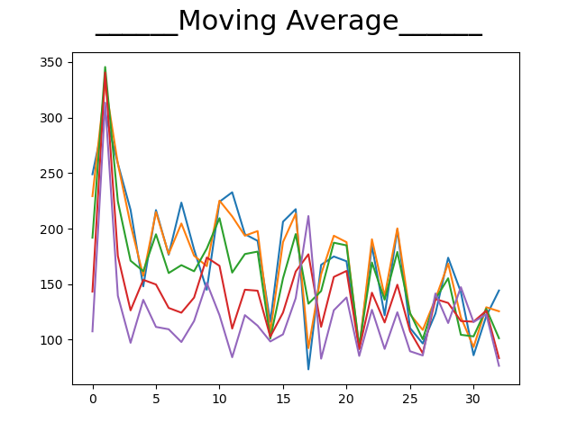

# Feature Extaction, Verifcation and PCA on CGM TimeSeries
- Details regarding the working of the project, my implementation and output can be found in the folder file **"[Project-Description](Project-Description.pdf)"**
- My implemented code can be found in **[Code](Code)** 
- Graphs for the respective features and PCA can be found in **[Output](Output)**

## Introduction
In this project, we study the techniques used to extract the features and analysis of the principal components of the data to get the features with higher importance amongst others. The data provided is of meals eaten by a person and the glucose CGM levels are analyzed according to a given 2-and-a-half-hour time frame. The time starts from 30 mins before having the meal and continues to another 2 hours after starting to have the meal. The approach towards this project has been threefold wherein I first preprocessed the data, extracted the features and found the principal component analysis components using the feature matrix. My findings in this project will be complimented with representative graphs and thus portray my findings while working on the project as well as the final results.

### Project Phase 1: Pre-processing
The first phase of the project comprises of the preprocessing of the data. The data collection is done by the CGM sensor. Initially, keeping into consideration that the data has a lot of NaN values and a lot of missing data which might not be very good for future analysis I move towards preprocessing the data. In order to preprocess the data, I first took a look at it and removed unnecessary additional rows which had falsified data. My approach towards cleaning of the data led me to removing the data if it had a majority of NaN values which might not provide appropriate knowledge to train the model in the future so I keep the passing mark of less than 40% NaN values. This removes those rows from consideration but now to tackle the remaining NaN values, I quadratically fit the data to find the missing values using interpolation techniques of order 2. Also, as 31st column data has maximum missing values I completely pruned that row from consideration and moved further towards feature extraction.
Now, the data has been fully preprocessed. It has 30 rows covering 2 and a half hours of time duration at 5-minute intervals.

### Project Phase 2: Feature Extraction
In this phase, I have selected and implemented four feature extraction methods for the given data. I have carefully selected moving features with a window of 10 and with 40% overlapping as they provide more features which are distributed between different parts of data.

The four feature extraction techniques that I have used are:
1.	**Fast Fourier Transform for real input**
2.	**Moving Kurtosis**
3.	**Moving Standard Error of Mean**
4.	**Moving Average**

### Project Phase 3: Feature Selection 
Principal Component Analysis (PCA) takes only one matrix, so, I merged the results obtained in Phase 2 in a single matrix. Hence, the feature matrix will have (No. of patient meals) x 20 features corresponding to each action and the rows corresponding to the timestamps in Phase 2. I was able to find few useful features having higher discrimination power by plotting graphs against every feature for every patient. Hence, I further decided to proceed with selected features to perform PCA on the resulting matrix to find best latent semantics which have the highest discrimination power, even among the ones selected during Phase 2 feature selection process.
The [Output/PCA](PCA-Graphs) represent each principal component vectors for the data along with which data can be projected individually.

## Input Data
**Input:** Time Series data for 5 patients:
1.	The first set of files have tissue glucose levels every 5 mins for 2.5 hours during a lunch meal (“CGMSeriesLunchPatX.csv”).
2.	The data starts from 30 mins before meal intake an continues up to 2 hours after the meal consumption has started.
3.	There are several such time series per subject patient which can be found in “CGMSeriesLunchPat**X**.csv”.
4.	The second set of files contain the respective time stamps of each time series related to the first set of files containing glucose levels (CGMDatenumLunchPat**X**.csv).
5.	The time stamp which has the highest glucose level is observed is the time at which the meal was logged.

## Output Graphs
**Output:** Feature Graphs and PCA for 5 patients found in **[Output](Output)**
- Example output for Patient 1:


 


## Requirements
```
pandas==0.25.3
matplotlib==320rc1
scipy==1.3.2
sklearn==0.0
```

## Command Line
```
python Code.py
```

## Tested Running Environment
**OS:** Windows 10
**Python:** 3.7
